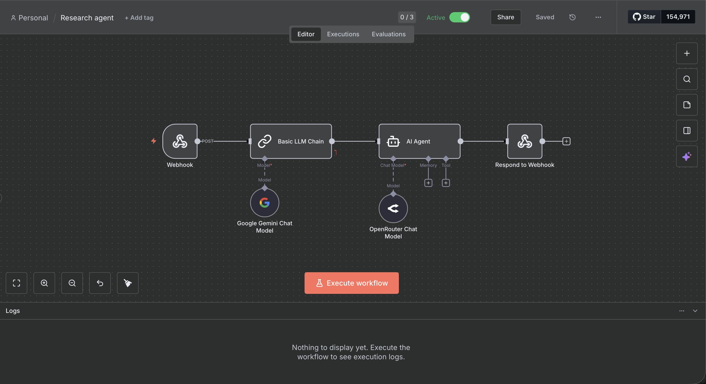

# Speech-to-Speech Research Agent

A n8n workflow that processes search queries through AI language models to generate concise research summaries.

## Overview

This workflow receives search queries via webhook, processes them through Google Gemini for initial analysis, and then uses an AI agent powered by OpenRouter to create a three-sentence summary of the research findings.

## Architecture

The workflow consists of five main components:

1. **Webhook Trigger**: Receives incoming POST requests with search queries
2. **Basic LLM Chain**: Processes the search query using Google Gemini
3. **AI Agent**: Generates concise summaries using OpenRouter's language models
4. **Response Handler**: Returns the processed results to the webhook caller

## Workflow Diagram



## Prerequisites

- n8n instance (self-hosted or cloud)
- Google Gemini API credentials
- OpenRouter API credentials

## Installation

1. Import the workflow JSON file into your n8n instance
2. Configure the following credentials:
   - Google Gemini API
   - OpenRouter API
3. Update the webhook path and ID in the Webhook node
4. Activate the workflow

## Configuration

### Webhook Node

- **HTTP Method**: POST
- **Path**: Set your custom webhook path
- **Response Mode**: Response Node

### Google Gemini Chat Model

Configure your Google Gemini API credentials in the credentials section.

### OpenRouter Chat Model

Configure your OpenRouter API credentials in the credentials section.

### AI Agent System Prompt

The AI Agent is configured with the following system message:

```
You are an expert research agent. You will be fed information, and you need to make a concise summary. It should only be about three sentences
```

## Usage

Send a POST request to your webhook URL with the following JSON structure:

```json
{
  "searchQuery": "Your research query here"
}
```

The workflow will process the query and return a concise three-sentence summary.

### Example Request

```bash
curl -X POST https://your-n8n-instance.com/webhook/YOUR_WEBHOOK_PATH \
  -H "Content-Type: application/json" \
  -d '{"searchQuery": "Latest developments in artificial intelligence"}'
```

### Example Response

```json
{
  "output": "Recent advancements in artificial intelligence have focused on large language models and multimodal AI systems. Major tech companies have released increasingly powerful models capable of understanding and generating text, images, and code. These developments are being integrated into various applications, from customer service to creative tools."
}
```

## Workflow Details

### Node Configuration

#### 1. Webhook Node
- Listens for incoming POST requests
- Extracts the search query from the request body
- Passes data to the LLM Chain

#### 2. Basic LLM Chain
- Uses Google Gemini for initial query processing
- Processes the raw search query text
- Prepares data for the AI Agent

#### 3. AI Agent
- Powered by OpenRouter Chat Model
- Generates concise three-sentence summaries
- Follows the expert research agent system prompt

#### 4. Respond to Webhook
- Returns the processed summary to the caller
- Completes the webhook request-response cycle

## Customization

### Adjusting Summary Length

To modify the summary length, edit the system message in the AI Agent node:

```
You are an expert research agent. You will be fed information, and you need to make a concise summary. It should only be about [X] sentences
```

### Changing Language Models

You can swap out either language model by:
1. Disconnecting the current model from the chain
2. Adding your preferred language model node
3. Connecting it to the appropriate chain or agent

### Adding Additional Processing

You can extend this workflow by adding nodes between existing components:
- Add data transformation nodes after the Webhook
- Include additional AI processing steps
- Add logging or database storage nodes

## Troubleshooting

### Webhook Not Triggering

- Verify the webhook is activated
- Check that the webhook path is correct
- Ensure the request method is POST

### API Credential Errors

- Verify your Google Gemini API key is valid
- Confirm your OpenRouter API key has sufficient credits
- Check that credentials are properly linked to the respective nodes

### Empty or Incomplete Responses

- Verify the input data structure matches the expected format
- Check the AI Agent system prompt configuration
- Review the language model settings and parameters

## Technical Requirements

- n8n version: 1.0.0 or higher
- Node versions:
  - webhook: 2.1
  - chainLlm: 1.7
  - lmChatGoogleGemini: 1
  - agent: 3
  - respondToWebhook: 1.4
  - lmChatOpenRouter: 1

## License

This workflow is provided as-is for educational and commercial use.

## Support

For issues and questions:
- Check the n8n community forums
- Review the official n8n documentation
- Consult the Google Gemini and OpenRouter API documentation

## Contributing

Contributions to improve this workflow are welcome. Consider:
- Adding error handling mechanisms
- Implementing retry logic for API failures
- Adding support for additional language models
- Enhancing the summarization prompts

## Changelog

### Version 1.0.0
- Initial release
- Basic webhook to summary pipeline
- Google Gemini and OpenRouter integration
- Three-sentence summary generation
